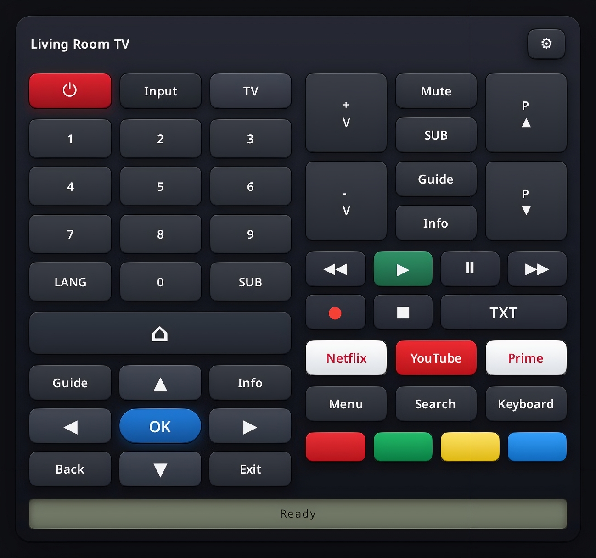

# Couch Remote

Couch Remote is a GTK remote control for Android TV and Google TV devices on the local network.

It provides a physical remote-style interface, network discovery, pairing, saved TV profiles, Wake-on-LAN, configurable key mappings, text input, diagnostics, app launching, and a command line interface.



## Features

- Android TV / Google TV pairing over Android TV Remote v2
- Local network discovery with Avahi
- Multiple saved TV profiles
- Wake-on-LAN support
- Configurable action-to-key mappings per TV
- Key tester for model-specific buttons
- Text input from the computer keyboard
- Connection diagnostics
- GTK desktop interface
- Command line interface

## Install

### Flatpak repository (recommended, auto-updating)

Install directly from the project's GPG-signed Flatpak repository:

```bash
flatpak install --user https://angelodelorenzo.github.io/couch-remote/couch-remote.flatpakref
flatpak run io.github.angelodelorenzo.couch-remote
```

This installs the app and registers the repository as its origin, so new
versions arrive with a normal update:

```bash
flatpak update
```

The app needs the `org.gnome.Platform` runtime, which Flatpak pulls from Flathub
on first install. The repository is built for x86_64.

### Flatpak bundle (single file)

Prefer a one-off, offline install? Download the latest `couch-remote-*.flatpak`
bundle from the
[Releases page](https://github.com/AngeloDeLorenzo/couch-remote/releases/latest),
then:

```bash
# One-time: add Flathub so the GNOME runtime can be downloaded
flatpak remote-add --if-not-exists flathub https://flathub.org/repo/flathub.flatpakref

# Install the downloaded bundle (adjust the filename to the version you got)
flatpak install --user couch-remote-1.0.6.flatpak

flatpak run io.github.angelodelorenzo.couch-remote
```

A bundle does not auto-update; reinstall a newer one to upgrade.

To uninstall (either method):

```bash
flatpak uninstall --user io.github.angelodelorenzo.couch-remote
```

## Install For Development

```bash
python3 -m venv .venv
. .venv/bin/activate
pip install -e .
```

The GTK interface also requires PyGObject and GTK 3 from the system packages. Discovery requires `avahi-browse`.

On Debian-based systems:

```bash
sudo apt install python3-gi gir1.2-gtk-3.0 avahi-utils
```

## Usage

Start the graphical interface:

```bash
couch-remote-gui
```

From **Settings**, scan for Android TV devices, select one, then start pairing. The TV will show a code that must be entered in Couch Remote.

Command line examples:

```bash
couch-remote scan
couch-remote pair --name "Living Room TV" --host 192.168.1.50
couch-remote devices
couch-remote use "Living Room TV"
couch-remote status
couch-remote diagnose
couch-remote action volume_up
couch-remote text "search text"
couch-remote launch youtube
```

## Key Mapping

Couch Remote sends logical actions such as `volume_up`, `subtitle`, `teletext`, `guide`, and `ok`. Every action can be remapped per device:

```bash
couch-remote actions
couch-remote candidates
couch-remote map subtitle CAPTIONS
couch-remote map subtitle TV_MEDIA_CONTEXT_MENU
couch-remote map service_menu SETTINGS DPAD_DOWN DPAD_CENTER
couch-remote reset-map subtitle
```

The GTK app exposes the same workflow through **Settings** and **Test Keys**.

## Diagnostics

When a TV stops responding, run:

```bash
couch-remote diagnose
```

The diagnostics report checks the selected profile, certificate files, name/IP resolution, Android TV and Cast ports, and the Android TV Remote connection state. The same report is available from **Settings** and **Diagnostics** in the GTK app.

## Data And Privacy

Couch Remote stores device profiles and pairing certificates locally in:

```text
~/.config/couch-remote
```

Pairing certificates are required to control Android TV devices. Couch Remote does not send telemetry.

## Packaging

A Flatpak manifest is provided in:

```text
packaging/flatpak/io.github.angelodelorenzo.couch-remote.yml
```

The app id is:

```text
io.github.angelodelorenzo.couch-remote
```

To build and install it locally:

```bash
flatpak install flathub org.gnome.Platform//50 org.gnome.Sdk//50 org.flatpak.Builder
flatpak run org.flatpak.Builder --force-clean --install --user builddir \
  packaging/flatpak/io.github.angelodelorenzo.couch-remote.yml
```

To produce the single-file `.flatpak` bundle attached to releases:

```bash
flatpak run org.flatpak.Builder --force-clean --repo=repo builddir \
  packaging/flatpak/io.github.angelodelorenzo.couch-remote.yml
flatpak build-bundle repo couch-remote.flatpak io.github.angelodelorenzo.couch-remote master
```

## Limitations

Couch Remote 1.0 supports Android TV and Google TV only. Other TV ecosystems such as LG webOS, Samsung, Roku, and HDMI-CEC are intentionally out of scope for this release.

Some Android TV models use manufacturer-specific behavior for buttons such as subtitles, teletext, language, and colored keys. Use the key tester to find and remap the working code for your model.
